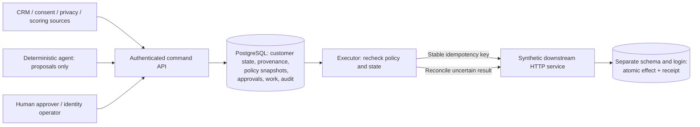

# Enterprise MarTech / AI Control Plane

An executable governance boundary for customer data and automated actions. A CRM workflow or AI agent can propose a change; it cannot choose which source is authoritative, restore consent, approve its own marketing request, or write directly to the downstream system.

**The tools can execute. The control layer determines what is actually true.**

This independent portfolio implementation by Richard Butts uses entirely synthetic customer data and a synthetic downstream HTTP service. It demonstrates engineering capability, not a claimed client deployment or integration with Salesforce, HubSpot, OpenAI, or a cloud platform.

**Start with the [generated proof](docs/evidence/report.md).** It shows lifecycle regression refused, consent revoked after approval with zero messages, and a response lost after a remote commit recovered without a second business effect. The suite also kills a real worker process after the commit.



Python and explicit PostgreSQL transactions are sufficient for this bounded problem. PostgreSQL supplies uniqueness, row locks, durable work and audit protection; adding a broker would introduce another consistency boundary. FastAPI supplies closed API contracts. The downstream process exists to exercise an actual network boundary, rather than pretending that a function call proves remote recovery.

## Run the demonstration

With Docker Compose v2, from the repository root:

```bash
docker compose run --build --rm demo
docker compose down
```

The harness starts PostgreSQL, applies the migration, starts the API and synthetic downstream, then executes three asserted scenarios. It controls worker timing to reproduce the consent race deterministically. The agent calls use only the agent credential; the trusted demonstration harness separately supplies the human and executor roles. All sample credentials in Compose are local demonstration values. Only the API is published, on loopback port 8000. No SaaS account is required.

For the complete verification, including database permissions, concurrent workers, malformed input and process death:

```bash
docker compose --profile test run --build --name control-proof verify
docker cp control-proof:/app/docs/evidence ./local-proof
docker rm control-proof
docker compose down
```

Use a fresh container name if `control-proof` already exists. Verification uses a separate disposable `control_test` database. The demo uses `control_demo`. `down` preserves data; `down --volumes` intentionally destroys this project's local database volume.

**Execution boundary:** the Python/PostgreSQL/HTTP implementation and native demonstration were executed on Windows. Docker was unavailable on the build host, so the Compose path is provided and checked structurally but is not claimed as executed. GitHub Actions includes both native integration and container-demo jobs; no remote CI success is claimed. The fully executed alternative needs Python 3.12 and an existing local PostgreSQL 17 database:

```bash
python -m venv .venv
# Activate .venv for your shell, then:
python -m pip install -r requirements.lock
python -m pip install --no-deps --no-build-isolation -e .
# Set CONTROL_ADMIN_DSN to a disposable database you own, e.g. control_demo.
python scripts/local_demo.py
# Set TEST_ADMIN_DSN to a separate disposable database ending in _test.
python scripts/verify.py
```

[Operations](docs/operations.md) contains exact environment examples, continuous worker operation and operator recovery commands. Dependency versions are the tested lock, not a claim to use the newest packages.

## What the repository proves

| Boundary | Implemented behavior | Executable evidence |
|---|---|---|
| Identity | Source IDs map to canonical UUIDs; matching email only produces review candidates; ambiguous candidates never merge | Identity collision, reviewed linking, forbidden rebinding and parallel admission tests |
| Authority | Field-specific owners and per-record source sequence; higher sequence cannot grant source authority | Lower-authority, stale sequence and concurrent update tests |
| No-Regress | Generic ordered lifecycle policy from Lead through Customer | PostgreSQL scenario plus 100 generated policy examples |
| Agent control | Typed proposals: internal profile sync allowed, marketing requires approval, consent writes denied | Role matrix, protected-write and malformed-contract tests |
| Approval | Exact customer revision, policy hash and expiry; checks repeat before new dispatch | Revocation, suppression, stale context, duplicate and expired approval tests |
| Recovery | Durable leases, fenced local completion, bounded retries, reviewable dead letters | Eight workers, expired leases, 429/500/422, timeouts before/after commit, process kill |
| Remote effects | Mutation and idempotency receipt commit together; unknown results reconcile first | Repeated and concurrent remote delivery yields one receipt; changed payload conflicts |
| Accountability | Source body/result ledger, before/after provenance, actor and policy snapshot, dispatch/result audit | Audit contents, migration checksum, denied UPDATE/DELETE/TRUNCATE and cross-schema access tests |

Delivery is **at least once with idempotent downstream effects under the demonstrated adapter contract**. A worker may send the same intent more than once. A unique remote key and immutable payload prevent duplicate effects. There is no distributed exactly-once claim.

Consent is checked at durable dispatch authorization. A revocation committed before that point blocks marketing. A request already authorized and in flight may still commit afterward; the control plane cannot recall bytes already sent to an independent system. Recovery reports a previously committed effect honestly, even if consent has since changed. See the precise [failure semantics](docs/failures.md).

## Read further

- [Architecture and transaction boundaries](docs/architecture.md)
- [Identity, field ownership and agent boundary](docs/governance.md)
- [Failures, uncertainty and recovery](docs/failures.md)
- [Operator runbook and local setup](docs/operations.md)
- [Validation, review findings and benchmark](docs/validation.md)
- [Scaling and known limits](docs/limits.md)

The implementation is in `src/controlplane`; the checksum-checked SQL migration is packaged beside it. Tests use a real PostgreSQL instance and separately launched HTTP processes. `scripts/verify.py` regenerates the proof and source hashes. Billing, GL reconciliation, M&A migration and revenue-integrity workflows are deliberately outside this project's customer/MarTech scope.
