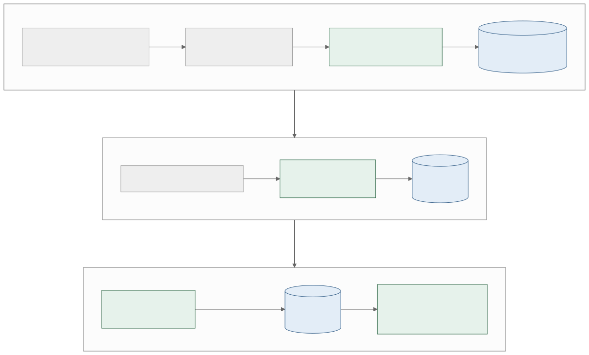
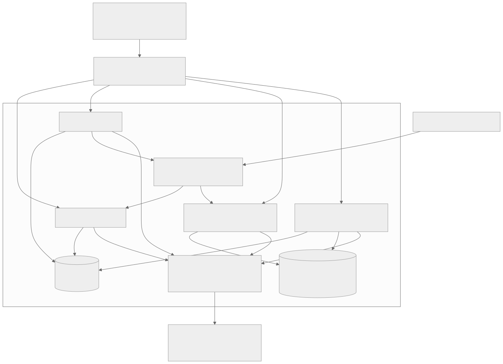

# Enterprise MarTech / AI Control Plane

Customer and commercial state crosses CRM, consent, scoring, revenue operations and activation systems. Each can trigger work; none should independently override authoritative truth. This control plane governs the boundary: who owns a field, which customer an event belongs to, whether a lifecycle change is valid, and whether an automated action is still authorized when it executes.

**Tools execute. The control layer determines what is true.**

Built for the integration demands of multi-product B2B SaaS and enterprise commercial operations: canonical identity, source provenance, No-Regress Logic, consent and approval controls, durable execution, and recovery across independent systems. AI agents submit typed proposals; they do not receive source authority or downstream execution credentials.

**Start with the [executed proof](docs/evidence/report.md), [enterprise workload results](docs/evidence/enterprise-workload.json), and [database recovery design](docs/cloud-operations.md).** The implementation includes deployable AWS infrastructure, distinct service identities, immutable releases and a fail-closed recovery gate.



## The invariants

| Boundary | Enforced behavior |
|---|---|
| Identity | Source record IDs resolve to canonical UUIDs. Matching email creates review candidates, never an automatic merge. |
| Authority | Field owners and source sequences determine accepted state. A later event cannot grant a source authority it does not have. |
| No-Regress | Lifecycle advances through Lead → MQL → SQL → Opportunity → Customer; stale regression is refused. |
| Consent and approval | Protected writes are denied. Marketing needs explicit approval bound to customer revision, policy and expiry. Current permission is checked again before dispatch. |
| Execution | A durable intent, stable effect ID and immutable payload survive retries. Leases distribute work; tokens fence stale workers. |
| Recovery | Unknown outcomes query the original receipt first. Restored control state is compared with the independent downstream ledger before services resume. |
| Accountability | Decisions retain actor, source evidence, provenance and policy hash. Application roles cannot rewrite audit history. |

## Execution and failure semantics

The API validates a proposal and commits eligible work to PostgreSQL. A worker claims it, locks the customer, rechecks permission, and commits the dispatch intent **before** making an HTTP request. The downstream commits its business effect and idempotency receipt together.

If the response disappears or the worker dies, the next worker looks up the same effect ID. A matching receipt establishes an existing fact; it does not authorize another action. An absent receipt requires a fresh permission check before retry. Conflicting identities, permanent rejection and exhausted retry budgets become reviewable exceptions.

Delivery is **at least once with idempotent effects under the downstream adapter contract**. Consent is enforced at dispatch authorization; an independently running remote system cannot recall an already in-flight request. See [precise failure semantics](docs/failures.md) and the [execution diagram](docs/diagrams/04-execution.svg).

## AWS operating architecture



- Separate Fargate services for API, workers, downstream and a read-only observer; one-shot migration and verification tasks.
- Immutable ECR tags and digest-qualified task revisions, bound to source commits. Protected GitHub OIDC releases use short-lived authority.
- Two private, encrypted PostgreSQL RDS instances keep control state and downstream receipts in independent recovery domains. Multi-AZ, 14-day PITR, deletion protection and TLS are configured.
- Private HTTPS ingress, explicit service-to-database security groups, and private ECR/Secrets/Logs endpoints. No public database, public task address or NAT dependency.
- Secrets Manager values are created and retrieved at runtime. Terraform contains secret identifiers, never application passwords or token values.
- CloudWatch tracks eligible-work age, unresolved outcomes, retries, reconciliations, dependency errors and worker heartbeat. Metrics have only environment/service dimensions.

[Infrastructure and deployment](infra/README.md) covers foundation state, enterprise network/PKI prerequisites, IAM grants, the immutable image path and controlled releases. [Trust boundaries](docs/diagrams/03-trust-boundaries.svg) show which service can access each authority.

### Recovery is a business-integrity gate

A successful database restore alone is insufficient. Downstream effects can be newer than the restored local record. The operating tools drain admission and execution, restore into a **new** instance, bind its endpoint, and compare all local intents with independent receipts. Missing intents, mismatched hashes and missing acknowledged receipts keep services closed. A saved pass report cannot reopen them: resume runs a fresh verification task.

[Restore and reconciliation runbook](docs/cloud-operations.md) · [Recovery diagram](docs/diagrams/06-database-restore.svg) · [Executed remote-ahead case](docs/evidence/remote-ahead-restore.json)

## Workload and capacity

| Validation layer | Purpose and observed result |
|---|---|
| Exact correctness suite | Original 68 tests retained, plus cloud authority, restore comparison and release-gate cases; real PostgreSQL and separate HTTP processes. |
| Enterprise workload | 1,000 customer accounts, 1,000 intents, four worker processes, 1,200 attempts; 950 unique effects, 50 intended permanent rejections, 50 lost acknowledgements reconciled, zero duplicate effects. |
| Measured local run | 19.3 seconds admission; 55.5 seconds drain; 18.0 intents/second during drain. HTTP admission p95: 63 ms. |
| Production capacity model | Explicit connection budgets, admission-lock limits, worker concurrency, retention, failure domains and scaling decision points. |

The workload has deterministic source records and fault schedules; timings and generated receipt IDs are observations. [Capacity and boundaries](docs/capacity.md) explains why a larger customer estate does not imply unbounded event throughput, and when pooling, partitioning or queue separation becomes justified.

## Run and verify

With Docker Compose v2:

```bash
docker compose run --build --rm demo
docker compose down
```

The demo asserts authority protection, the consent race and lost-acknowledgement recovery. To run the full suite in a container:

```bash
docker compose --profile test run --build --name control-proof verify
docker cp control-proof:/app/docs/evidence ./local-proof
docker rm control-proof
docker compose down
```

For native development, use Python 3.12 and a dedicated PostgreSQL 17 instance:

```bash
python -m venv .venv
# Activate .venv for your shell.
python -m pip install -r requirements.lock
python -m pip install --no-deps --no-build-isolation -e .
# CONTROL_ADMIN_DSN: a disposable demo database you own.
python scripts/local_demo.py
# TEST_ADMIN_DSN: a separate disposable database ending in _test.
python scripts/verify.py
```

The verifier deliberately recreates its test schemas. [Local operations](docs/operations.md) supplies exact environment examples. [Workload instructions](docs/capacity.md) use a separate empty database. Infrastructure validation needs Terraform 1.13.5 and Trivy 0.75.0, **no AWS credentials**:

```bash
python scripts/validate_infra.py
```

## Evidence and implementation map

| Review area | Entry point |
|---|---|
| Governance and transactions | [Architecture](docs/architecture.md), [governance](docs/governance.md), [source](src/controlplane/service.py) |
| Leases and reconciliation | [Worker](src/controlplane/worker.py), [failure model](docs/failures.md), [tests](tests/test_execution.py) |
| Deployment and security | [Terraform](infra/aws), [runtime bootstrap](src/controlplane/cloud.py), [release gate](src/controlplane/release.py) |
| Restore and operations | [Read-only comparison](src/controlplane/operations.py), [PITR tool](src/controlplane/restore.py), [runbook](docs/cloud-operations.md) |
| Verification | [Generated test proof](docs/evidence/verification.json), [infrastructure checks](docs/evidence/infrastructure/verification.json), [validation guide](docs/validation.md), [GitHub Actions](https://github.com/rlbsem/enterprise-martech-ai-control-plane/actions) |

AWS resources have not been provisioned; live failover and PITR remain [environment acceptance checks](docs/cloud-operations.md).
