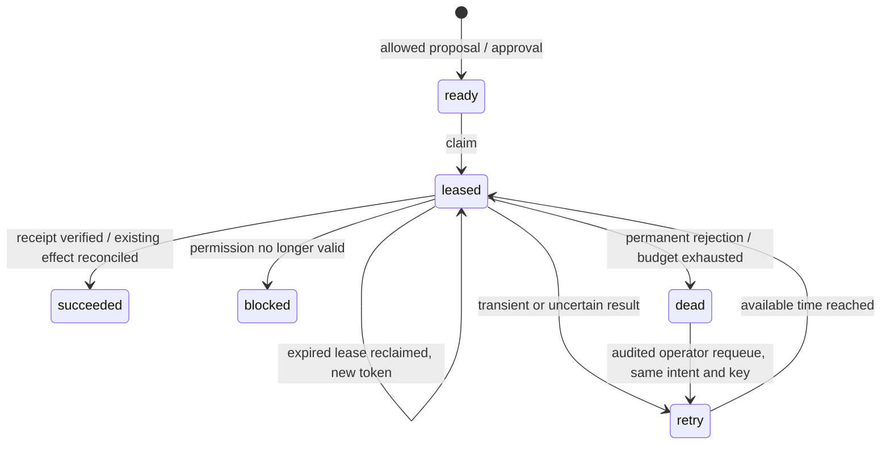

# Architecture and transaction decisions

## Boundaries and invariants

The command API owns canonical customer state. Upstream credentials select source authority; callers cannot submit a source or actor override. The agent receives customer context and submits proposals. The approver can authorize a proposal, while the operator can link reviewed identities and resolve exceptions. Neither endpoint supplies a downstream credential. Only the executor process sends governed mutations.

PostgreSQL has two schemas with separate non-owner logins. `control_app` can work within `cp`, append audit and source events, and read immutable policy snapshots. It cannot edit/delete/truncate audit, edit event history, create policy snapshots, or access remote tables. `synthetic_remote` can append effects and manage failure plans in `remote`; it cannot access canonical state. Migration ownership is separate. These boundaries protect against an API actor and accidental application SQL; they do not make a compromised application process or database owner harmless.

| Transaction | Locks and durable result |
|---|---|
| Source admission | Global identity/admission advisory lock, then customer row; deduplication, governed field decisions, provenance, source result and audit commit together |
| Identity link | Same admission lock and customer row; one subject per source per canonical customer; evidence audited |
| Proposal | Customer row, request-key advisory lock; decision and optional work row commit together |
| Approval | Customer row then proposal row; current state/policy/expiry checked; approval and work insertion commit together |
| Worker claim | `FOR UPDATE SKIP LOCKED` chooses one ready/retry or expired leased row; fresh lease token and attempt audit commit |
| Dispatch preparation | Customer row then job row; fence and current policy checked; exact mutation and uncertain intent commit before HTTP |
| Remote mutation | Advisory key lock; existing key/hash checked; effect and receipt inserted together |
| Completion | Job row; lease token must still match; result, retry/dead-letter/blocked state and audit commit together |

No database transaction remains open during HTTP. This avoids tying customer writes to a slow remote response, at the cost of the explicitly documented authorization-to-effect gap. PostgreSQL documents `SKIP LOCKED` as appropriate for queue-like consumers rather than a general consistent reporting view; it is used only for work claiming here. [PostgreSQL SELECT reference](https://www.postgresql.org/docs/17/sql-select.html).

## Durable work

`uncertain` is independent of the queue status. A dead letter may still represent an unresolved remote outcome. On recovery, a worker first asks the downstream service whether the saved key committed. A matching receipt establishes a historical fact. A 404 permits a new policy check, not an unconditional resend. A failed reconciliation request prevents a new mutation. The persisted mutation never changes under a reused key.

A lease is a recovery mechanism; it cannot guarantee that an old HTTP request stopped. Local completion is fenced by token, and remote effects are protected by idempotency. Two leases may overlap at the network boundary after a long stall. The remote contract handles that case. `attempts` is the current retry-budget count; an operator requeue resets the budget, while append-only claim audit retains all historical attempts.

## Why these choices

Explicit psycopg transactions make lock ordering, uniqueness and the outbox boundary directly inspectable. There is one migration rather than an ORM-generated schema and a second migration framework. Its content hash is persisted under a migration lock; modifying an applied migration fails closed. Future changes require new migration entries and an explicit runner extension, not editing version 1 in place.

JSONB stores the small closed set of typed attributes and their field-level provenance; relational tables enforce identity, proposal and work uniqueness. A global admission lock deliberately prioritizes simple correct identity discovery at sample scale. It is a throughput limit, not a hidden scalability claim.

The policy is code-reviewed, versioned configuration plus deterministic evaluator code. Immutable database snapshots retain ownership, ordered lifecycle, action decisions and TTL/budget parameters. The generated source manifest identifies the evaluator used for this evidence. A policy semantic change requires a version bump and redeployment; there is no dynamic policy editor. Workers refuse proposals with a different policy hash. Historical proposals and audit remain readable.

Compose separates migration, API, executor and downstream credentials. Health and successful-migration conditions express startup dependencies. The native launcher uses the same modules and removes admin/downstream credentials from the API subprocess environment. [Compose startup reference](https://docs.docker.com/compose/how-tos/startup-order/).
